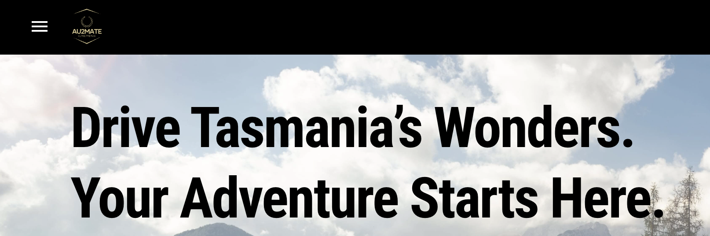
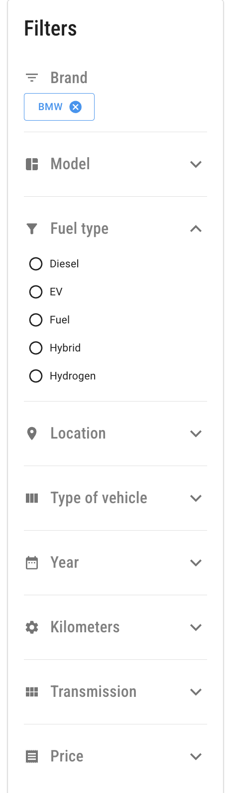
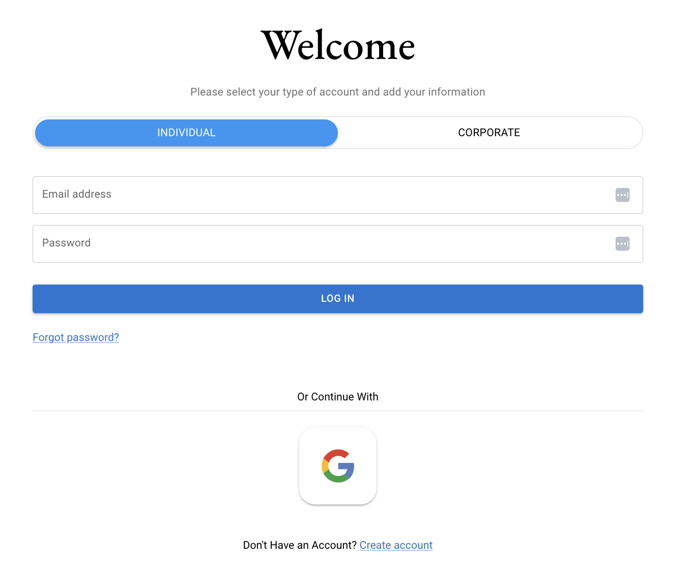
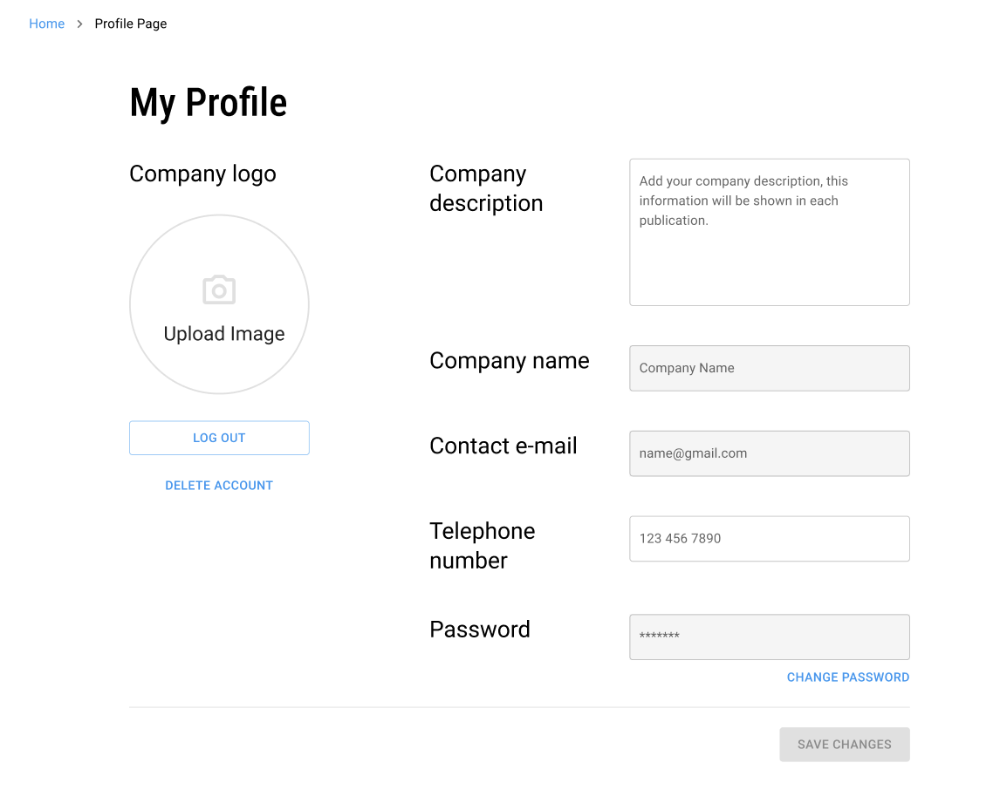
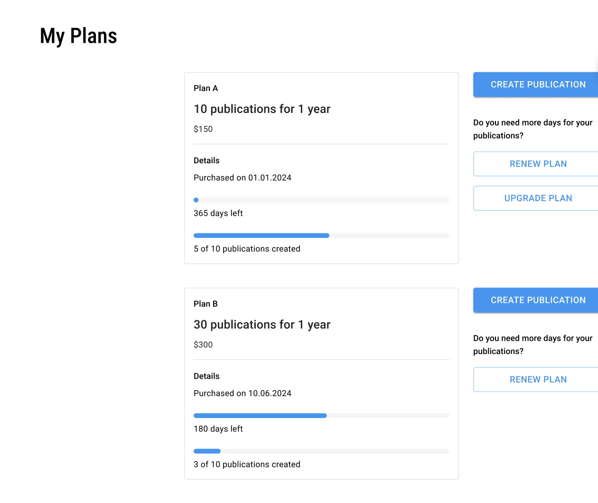
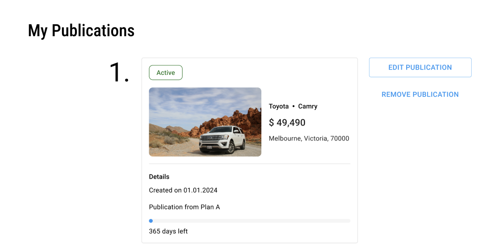

# AU2MATE.AU - showcase

## Overview

This project is designed to connect sellers and buyers of cars, motorbikes, boats, and RVs in Tasmania, Australia.

## Live Demo

[Live Demo](https://au2mate.au)

## Key Features

### Browse publications of vehicles (car, motorbike, boat, rv) for sell

Filter them by several criteria

### Account

- create an account (w/ password or google)
- confirm email with confirmation code
- login (w/ password or google) to see seller's details
- logout
- request a new password (if forgotten)
- resend confirmation code

### Profile

- upload company's logo and description
- change password
- delete the account

- see and renew plans

- edit and remove publications

- finish unfinished publications

### Subscription

- buy a plan to create a publication to sell your own vehicle
  - PayPal
  - credit card

## Technologies Used

- **Frontend**: React, Redux, Material-UI
- **Backend**: Node.js, Express.js
- **Database**: AWS RDS - Relational Database Service, Prisma/MySQL
- **Authentication**: AWS Cognito - JSON Web Tokens (JWT)
- **Deployment**:
  - frontend: GitHub Actions, S3, CloudFront
  - backend: GitHub Actions, Docker, Lightsail, CloudFront

## Project Architecture

The app is structured using a monolithic approach, with the frontend communicating with the backend via RESTful APIs.
The backend handles user authentication and task management, while user data is securely stored in an AWS RDS database.

## Team

[LinkedIn](https://www.linkedin.com/in/mychel-garzon-trujillo) Mychel Garzon Trujillo - _project management and frontend development_

[LinkedIn](https://www.linkedin.com/in/pinja-alanne-3920a1161) Pinja Alanne - _frontend development_

[LinkedIn](https://www.linkedin.com/in/doratokai28) Dóra Tokai - _frontend development_

[LinkedIn](https://www.linkedin.com/in/aj-kivimaki) Atte Kivimäki - _backend development_

## Contact

Feel free to [reach out](https://www.linkedin.com/in/aj-kivimaki) for any questions
